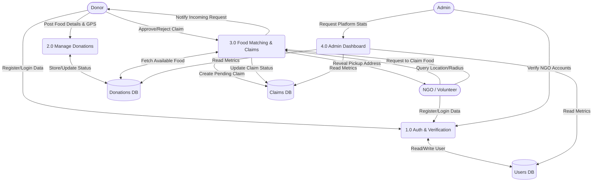

# ResQPlate

ResQPlate is a production-grade, location-based food rescue platform designed to bridge the gap between food donors (restaurants, events, individuals) and registered NGOs/volunteers. By leveraging real-time geospatial tracking and smart routing algorithms, ResQPlate ensures surplus food reaches those in need before it expires.

---

## Key Features

- **Role-Based Architecture:** Secure, distinct workflows for Donors, NGOs, and Admins.
- **Interactive Live Map:** Powered by React-Leaflet and OpenStreetMap. Features draggable search pins, custom search radii, and one-click reverse geocoding for pinpoint accurate pickup locations.
- **Smart Request & Approve Workflow:** NGOs request food claims, and Donors retain the power to approve or reject the pickup request, ensuring safety and control.
- **O(log N) Geospatial Queries:** Utilizes MongoDB's `2dsphere` indexes to instantly find available food within a user's exact proximity.
- **Algorithmic Volunteer Routing:** Uses a Modified Firefly Algorithm (mod-FA) to calculate and notify the most reliable and proximate volunteers when a new donation is posted.
- **Automated Data Integrity:** A background Node-Cron job automatically scans and flags expired donations every 5 minutes to keep the live map accurate.
- **Admin Control Center:** A comprehensive dashboard to monitor platform health, verify NGO accounts, and moderate global donations.

---

## Data Flow Diagram



## Tech Stack

### Frontend (Client)

- **Framework:** React.js (Vite)
- **Styling:** Tailwind CSS
- **Mapping:** React-Leaflet, Leaflet.js
- **Geocoding:** Nominatim (OpenStreetMap API)
- **Routing:** React Router v6
- **HTTP Client:** Axios (configured with cross-origin credentials)

### Backend (Server)

- **Environment:** Node.js, Express.js
- **Database:** MongoDB Atlas (Mongoose ODM)
- **Authentication:** JSON Web Tokens (JWT), bcrypt.js
- **Task Scheduling:** node-cron
- **Validation:** express-validator

---

## Environment Variables

To run this project locally or in production, you will need to add the following environment variables.

### Backend (`/backend/.env`)

| Variable     | Description                    | Example                 |
| ------------ | ------------------------------ | ----------------------- |
| `PORT`       | The port your backend runs on  | `8080`                  |
| `MONGO_URI`  | Your MongoDB connection string | `mongodb+srv://...`     |
| `JWT_SECRET` | Secret key for signing tokens  | `your_super_secret_key` |
| `JWT_EXPIRE` | Token expiration time          | `7d`                    |
| `CLIENT_URL` | The URL of your frontend       | `http://localhost:5173` |

### Frontend (`/frontend/.env`)

| Variable           | Description                 | Example                     |
| ------------------ | --------------------------- | --------------------------- |
| `VITE_BACKEND_URL` | The URL of your backend API | `http://localhost:8080/api` |

---

## Local Installation & Setup

**1. Clone the repository**

```bash
git clone https://github.com/manish01101/resqplate.git

```

**2. Go inside the repository**

```bash
cd resqplate/

```

**3. Setup the Backend**

```bash
cd backend
npm install
# Create your .env file here
npm run dev # npm run start

```

**4. Setup the Frontend**

```bash
cd ../frontend
npm install
# Create your .env file here
npm run dev

```
