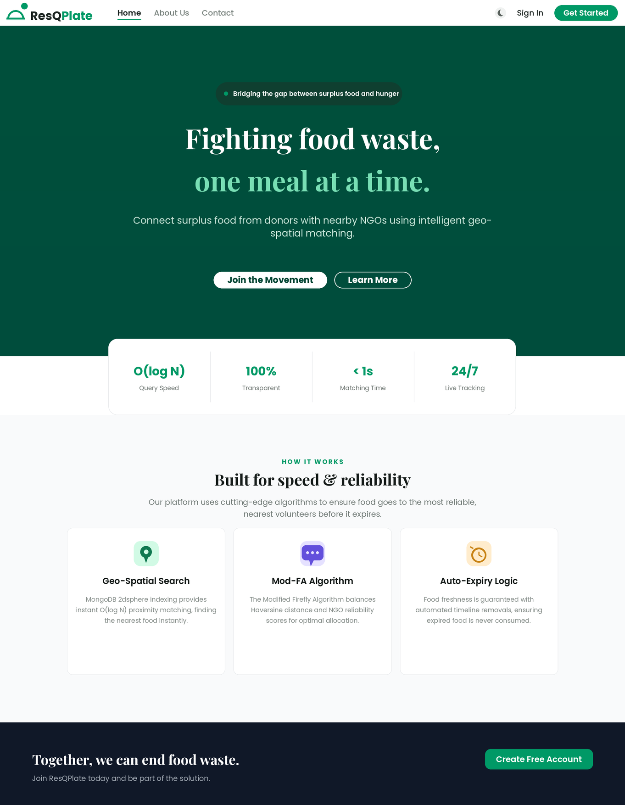
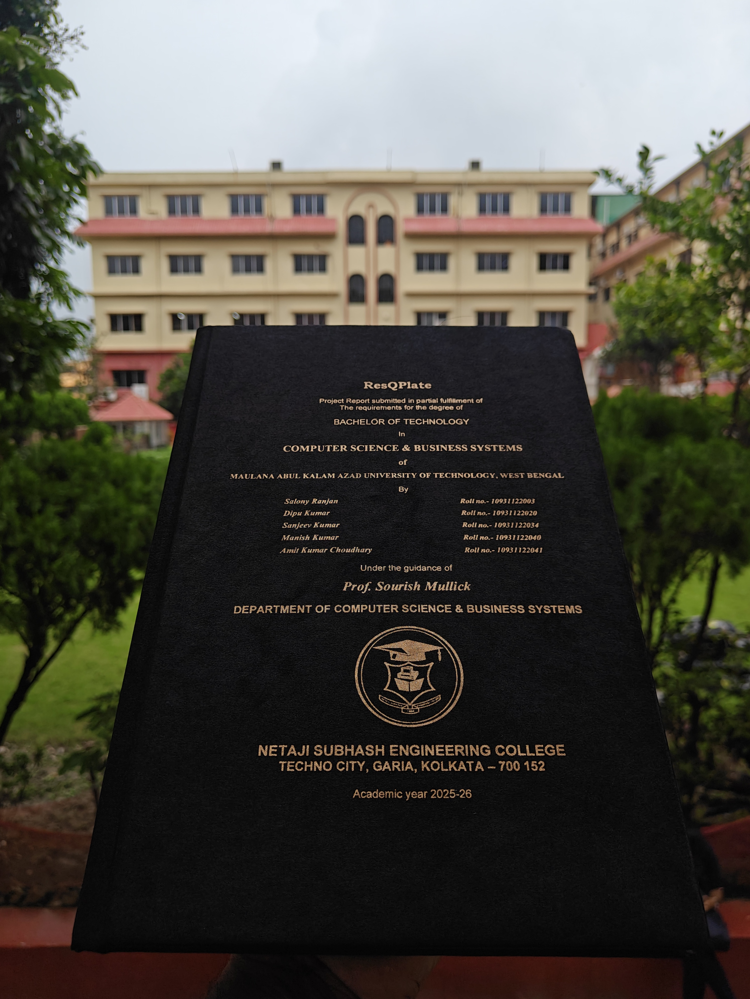
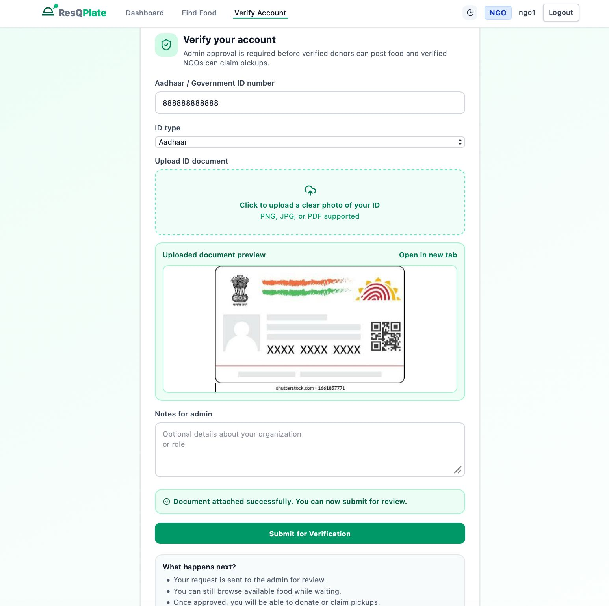
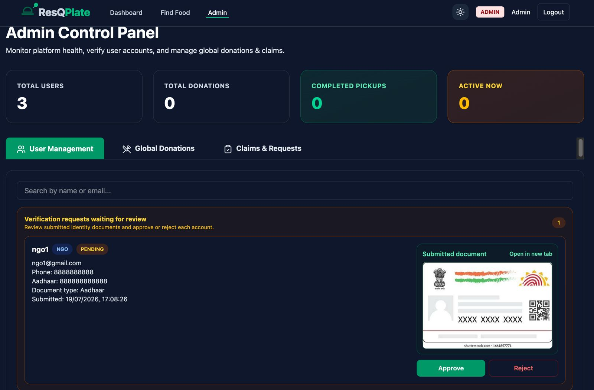
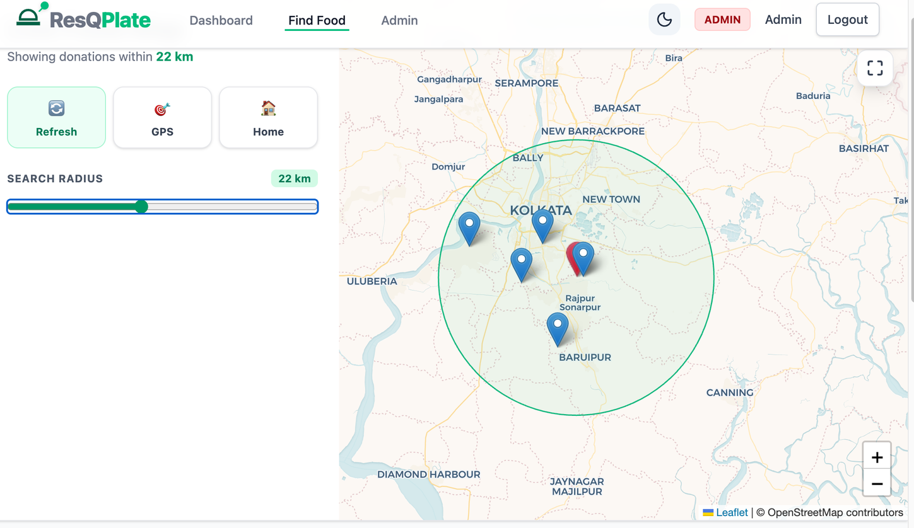
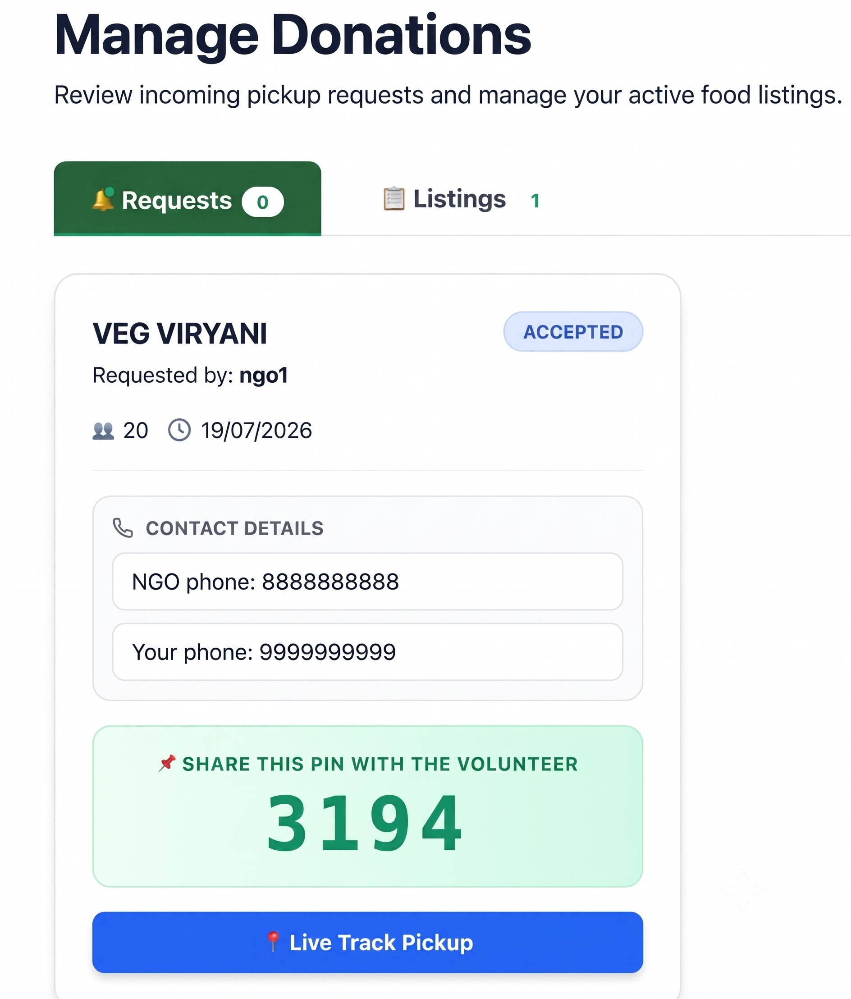
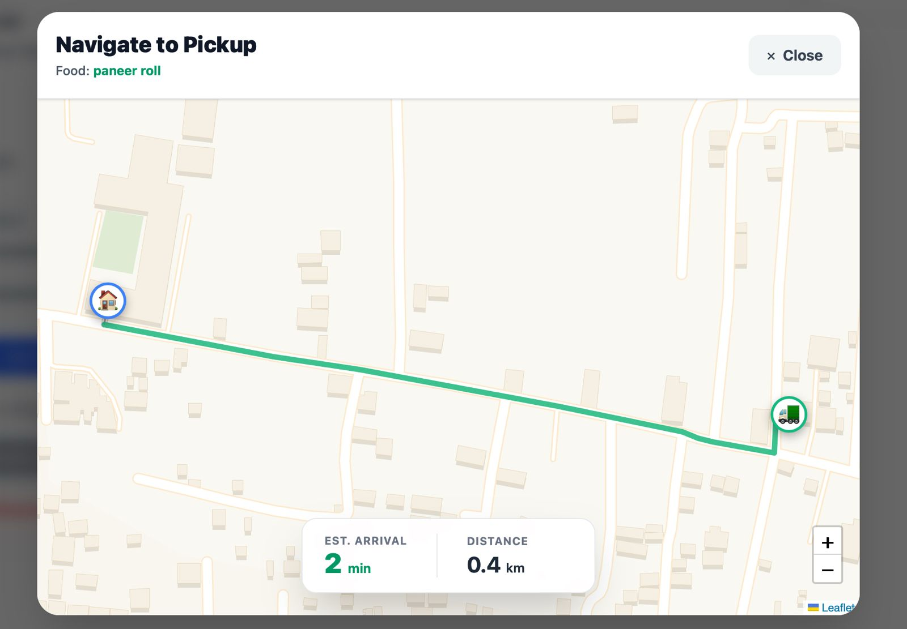
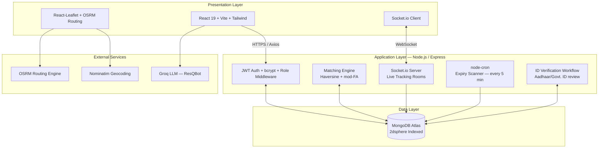

<div align="center">



# 🍽️ ResQPlate

### A real-time, geo-spatial food rescue platform that connects surplus food to hungry communities before it spoils.

[](https://resqplate-tan.vercel.app)
[](#-tech-stack)
[](#-license)
[](#-social--environmental-impact)

[**🚀 Live App**](https://resqplate-tan.vercel.app) · [**📖 Documentation**](#-documentation) · [**🐛 Report a Bug**](../../issues) · [**✨ Request a Feature**](../../issues)

</div>
<div align="center">

</div>

---

## 📌 The Problem

> **43 minutes.** That's the average time a donor spends manually phoning around before surplus food is either collected — or thrown away.

Every day, restaurants, hostels, and event halls throw away food that's still perfectly safe to eat, while NGOs a few kilometers away are actively searching for exactly that. The gap isn't a shortage of food — it's a shortage of **real-time coordination**.

- 🕳️ **No central place** for donors to notify NGOs that food is available
- ⏱️ **Cooked food spoils fast** — by the time a match is found by phone, it's often too late
- 🗺️ **No geolocation logic** — volunteers travel far for small pickups, or miss nearby ones entirely
- 🔓 **No trust layer** — no way to verify an NGO's identity or confirm the right person collected the food

**ResQPlate** replaces that ad-hoc phone-call chain with a live, map-driven, identity-verified platform — cutting the average coordination time from **45 minutes to 2.5 minutes**.

---

## ✨ Key Features

| | |
|---|---|
| 🪪 **Government ID Verification** | Donors and NGOs submit an Aadhaar/Govt. ID document, reviewed by an admin before they can post food or claim pickups — a real trust layer, not just an email checkbox. |
| 🛠️ **Admin Control Panel** | Live platform stats (users, donations, completed pickups, active-now) plus dedicated tabs for User Management, Global Donations, and Claims & Requests. |
| 🗺️ **Live Geo-Spatial Matching** | Haversine formula + MongoDB `2dsphere` indexing instantly surfaces the nearest available food — **O(log N)** instead of a full table scan. |
| 🔥 **Reliability-Aware Ranking (mod-FA)** | A Modified Firefly Algorithm ranks volunteers by urgency, proximity, *and* track record — not proximity alone — lifting pickup success from **60% → 86%**. |
| 🔐 **OTP-Secured Handoff** | A one-time 4-digit PIN is generated on claim approval and verified physically at pickup, closing the trust gap of peer-to-peer donation apps. |
| 📍 **Live GPS Tracking** | Socket.io-powered real-time location sharing gives donors a live ETA and route as the volunteer approaches. |
| 🤖 **ResQBot AI Assistant** | A Groq-powered conversational assistant (not a scripted FAQ bot) grounded in the platform's real matching, expiry, and role logic. |
| ⏳ **Automated Expiry Management** | A `node-cron` job sweeps every 5 minutes to auto-expire stale listings, so unsafe food is never shown as available. |
| 👥 **Role-Based Dashboards** | Purpose-built flows for **Donors**, **NGOs/Volunteers**, and **Admins**, each scoped to exactly what they need. |
| 🛡️ **JWT + bcrypt Security** | Signed, role-aware tokens on every protected route; passwords salted and hashed, never stored in plain text. |

---

## 🖼️ Product Walkthrough

<table>
<tr>
<td width="50%">

**Identity verification (Aadhaar / Govt. ID)**


</td>
<td width="50%">

**Admin Control Panel**


</td>
</tr>
<tr>
<td width="50%">

**Discover donations nearby**


</td>
<td width="50%">

**OTP-secured pickup**


</td>
</tr>
<tr>
<td width="50%">

**Live GPS navigation & ETA**


</td>
<td width="50%">

**Review & approve claim requests**


</td>
</tr>
</table>

<div align="center">

**Live, adjustable-radius food map**


**ResQBot — the AI food-rescue assistant**


</div>

---

## 🏗️ Architecture


```mermaid
flowchart TD
    subgraph Client["Presentation Layer"]
        A[React 19 + Vite + Tailwind]
        B[React-Leaflet + OSRM Routing]
        C[Socket.io Client]
    end

    subgraph Server["Application Layer — Node.js / Express"]
        D[JWT Auth + bcrypt + Role Middleware]
        E[Matching Engine<br/>Haversine + mod-FA]
        F[Socket.io Server<br/>Live Tracking Rooms]
        G[node-cron<br/>Expiry Scanner — every 5 min]
        V[ID Verification Workflow<br/>Aadhaar/Govt. ID review]
    end

    subgraph Data["Data Layer"]
        H[(MongoDB Atlas<br/>2dsphere Indexed)]
    end

    subgraph External["External Services"]
        I[OSRM Routing Engine]
        J[Nominatim Geocoding]
        K[Groq LLM — ResQBot]
    end

    A -->|HTTPS / Axios| D
    C <-->|WebSocket| F
    B --> I
    B --> J
    D <--> H
    E <--> H
    F --> H
    G --> H
    V <--> H
    A --> K
```

**Account lifecycle:** `Registered → Pending Verification (ID submitted) → Verified (admin-approved) → can post / claim food`

**Donation lifecycle:** `Available → Pending Claim → Approved (OTP generated) → In Transit (live GPS) → Completed (OTP verified)` — with automatic transitions to `Expired` (cron) or back to `Available` (rejected claim).

---

## 🧠 The Core Algorithm — mod-FA

A plain "nearest volunteer first" rule keeps notifying volunteers who accept but never show up. ResQPlate instead models each candidate as a *firefly*: food urgency is the light intensity, and attractiveness decays with distance.

```
β = β₀ · e^(−γr²)                         → attractiveness decays with distance r
intensity = urgencyScore × β              → urgency rises as shelf life < 2 hrs

if reliabilityScore < 0.5:
    effectiveScore = intensity × (reliabilityScore ÷ 0.5)   → penalize flaky volunteers
else:
    effectiveScore = intensity

finalScore = (effectiveScore × 0.6) + (reliabilityScore × 0.4)
→ sort descending, return top 3 (topK) for donor notification
```

Default parameters: `γ = 0.1`, `β₀ = 1.0`, reliability threshold `0.5`, `topK = 3`. Every volunteer's `reliabilityScore` is recomputed after each claim as `totalPickups ÷ (totalPickups + totalCancellations)`, so ranking quality compounds over time.

---

## 📊 Benchmarked Results

| Metric | Before | After ResQPlate | Improvement |
|---|---|---|---|
| Nearest-match query (10K users) | 1,850 ms (linear scan) | 32 ms (2dsphere index) | **~57× faster** |
| Pickup success rate | 75% (nearest-only) | 92% (mod-FA ranked) | **+17 pts** |
| Avg. coordination time | ~45 min (phone calls) | ~2.5 min | **~18× faster** |
| Donation cancellation rate | 25% | 8% | **−68%** |

*Full methodology and benchmark tables are in the [project report](#-documentation).*

---

## 🛠️ Tech Stack

<table>
<tr><td><b>Frontend</b></td><td>

`React 19 (Vite)` `Tailwind CSS 4` `React Router 7` `React-Leaflet` `Leaflet Routing Machine (OSRM)` `Socket.io-client` `Framer Motion`

</td></tr>
<tr><td><b>Backend</b></td><td>

`Node.js` `Express.js` `Mongoose` `express-validator` `jsonwebtoken` `bcryptjs` `node-cron` `Socket.io`

</td></tr>
<tr><td><b>Data</b></td><td>

`MongoDB Atlas` with `2dsphere` geo-indexing on Users & Donations

</td></tr>
<tr><td><b>AI / External</b></td><td>

`Groq SDK` (ResQBot) `Nominatim` (reverse geocoding) `OSRM` (routing) `EmailJS`

</td></tr>
<tr><td><b>Deployment</b></td><td>

`Vercel` (frontend) · Managed Node hosting (backend, persistent for WebSockets) · `MongoDB Atlas` (shared cluster)

</td></tr>
</table>

---

## 🚀 Getting Started

### Prerequisites
- Node.js ≥ 18
- A free [MongoDB Atlas](https://www.mongodb.com/atlas) cluster

### 1. Clone the repository
```bash
git clone https://github.com/salonyranjan/ResQPlate.git
cd ResQPlate
```

### 2. Set up the backend
```bash
cd backend
npm install
cp .env.example .env   # then fill in the variables below
npm run dev
```

### 3. Set up the frontend
```bash
cd ../frontend
npm install
cp .env.example .env   # then fill in the variables below
npm run dev
```

### Environment Variables

**`backend/.env`**

| Variable | Description | Example |
|---|---|---|
| `PORT` | Backend port | `8080` |
| `MONGO_URI` | MongoDB Atlas connection string | `mongodb+srv://...` |
| `JWT_SECRET` | Secret used to sign auth tokens | `your_super_secret_key` |
| `JWT_EXPIRE` | Token lifetime | `7d` |
| `CLIENT_URL` | Frontend origin (for CORS) | `http://localhost:5173` |
| `GROQ_API_KEY` | Powers the ResQBot assistant | `gsk_...` |

**`frontend/.env`**

| Variable | Description | Example |
|---|---|---|
| `VITE_BACKEND_URL` | Backend API base URL | `http://localhost:8080/api` |

App will be running at `http://localhost:5173` 🎉

---

## 📁 Project Structure

```
ResQPlate/
├── backend/
│   ├── controllers/     # auth, donation, claim, admin, verification logic
│   ├── models/           # User, Donation, Claim (Mongoose schemas)
│   ├── routes/           # /api/auth, /api/donations, /api/claims, /api/admin
│   ├── middleware/       # JWT verify, role-based authorize
│   ├── utils/algorithms.js   # Haversine + mod-FA matching engine
│   └── jobs/expiryJob.js     # node-cron auto-expiry scanner
└── frontend/
    ├── src/pages/         # Home, Dashboard, Find Food, Manage Donations, Verify Account, Admin
    ├── src/components/    # Map, ResQBot widget, forms, dashboards
    └── src/hooks/         # Socket.io + geolocation hooks
```

---

## 🌍 Social & Environmental Impact

| SDG | Contribution |
|---|---|
| **SDG 2** — Zero Hunger | Redirects surplus food to verified NGOs in near real time |
| **SDG 12** — Responsible Consumption | Auto-expiry + reliability-aware matching minimizes food loss |
| **SDG 13** — Climate Action | Less landfill-bound food waste → fewer methane emissions |
| **SDG 17** — Partnerships | Shared digital infrastructure for donors, NGOs, and municipalities |

---

## 🗺️ Roadmap

- [ ] AI-powered food-freshness detection via CNN image classification
- [ ] Blockchain-based donation ledger for corporate donor transparency
- [ ] IoT temperature/humidity sensors for bulk transport containers
- [ ] "Karma Points" gamification for donors and volunteers
- [ ] Adaptive mod-FA parameters (γ, β₀) auto-tuned per region
- [ ] Multilingual, retrieval-augmented ResQBot

Have an idea? [Open an issue](../../issues) — contributions and suggestions are welcome.

---

## 📖 Documentation

This project was built as a final-year B.Tech (CSBS) capstone at **Netaji Subhash Engineering College, Kolkata**, under the guidance of **Prof. Sourish Mullick**. The full engineering report — covering literature review, DFDs, ER diagrams, control-flow/state diagrams, SRS, security design, and benchmarked results — is available on request or in `https://drive.google.com/file/d/1WI46WO5v62MTfKLNhWCjnaBUl0pmw0KM/view?usp=sharing`.

---

## 🤝 Contributing

Contributions, issues, and feature requests are welcome!

1. Fork the repo
2. Create your feature branch (`git checkout -b feature/amazing-feature`)
3. Commit your changes (`git commit -m 'Add amazing feature'`)
4. Push to the branch (`git push origin feature/amazing-feature`)
5. Open a Pull Request

---

## 📄 License

Distributed under the MIT License. See `LICENSE` for details.

---

## 👥 Team

Built by **Salony Ranjan**,  Manish Kumar — Dept. of Computer Science & Business Systems, NSEC.

<div align="center">

**[🌐 Live Demo](https://resqplate-tan.vercel.app)** &nbsp;·&nbsp; **[⭐ Star this repo](../../stargazers)** if ResQPlate helped you or inspired your own project!

</div>
